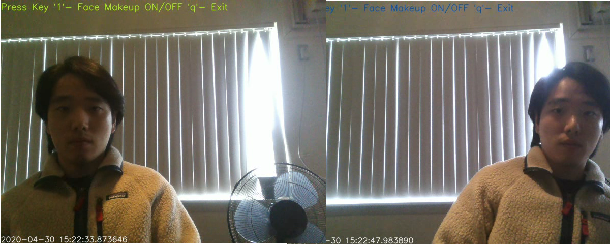
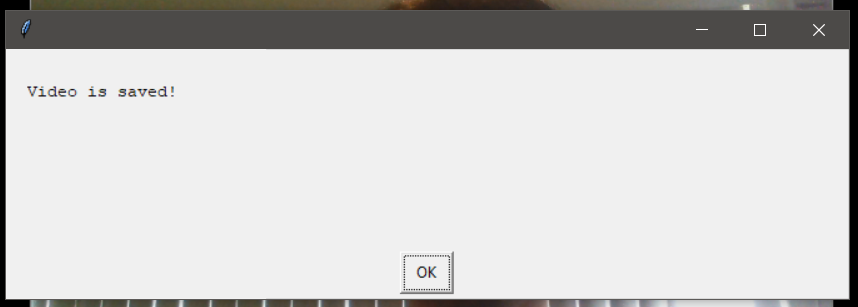
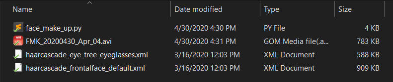

# Virtual Fitting Program

2020 Spring CPS497 Independent Study 
Joonwoo Park 
Central Michigan University

## Introduction
Fitting virtual accessory by face detection and computer vision for independent study project

## How it works

## Feature
  - ***face detection on & off*** 
  The program wait user's key input.
  Face detecting can be on and off when user push '1'. 
  

&nbsp;

  - ***Exception handling for image out of frame range*** 
  When the accessory 
   
  

&nbsp;

  - ***Auto recording and export as video*** 
  User can record the video as default. 
  When the program begin, it automatically record the video. 
  Then, user can check the output as .avi file at src folder. 
  

&nbsp;

## Reference

